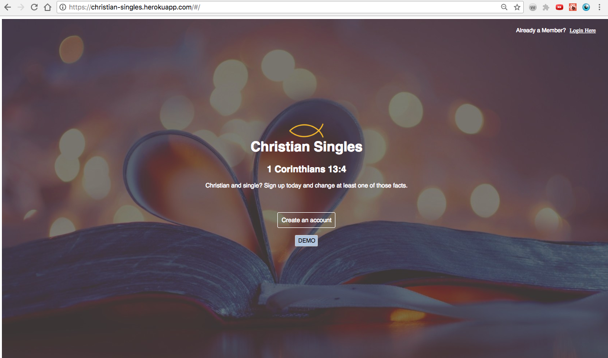
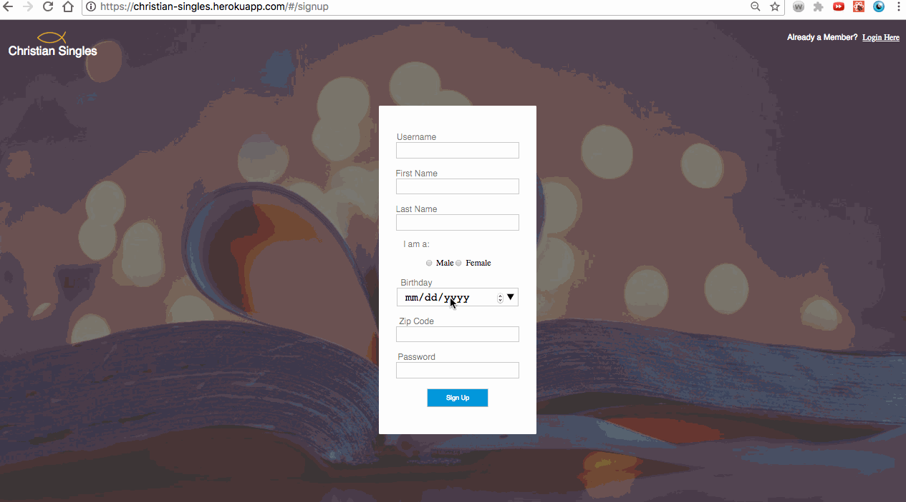

# Christian Singles

[Live site](https://christian-singles.herokuapp.com/#/)

**_Christian Singles_ is an early stage single page web app inspired by the popular dating site _Christian Mingle_. It uses a Ruby on Rails backend combined with a React/Redux frontend.**



### Key Features

- [x] Hosted on Heroku
- [x] User authentication
- [x] Create and maintain user profile, including preferences form
- [x] Browse profiles
- [x] Display match percentage between users based on preferences

#### User Authentication
BCrypt gem used for safely hashing users passwords.



#### Profile Maintenance

Users have the ability to create and maintain a profile that contains all the information necessary for formulating percentage matches with other users. Individual profiles display each user's personal information. Users also fill out a preference form that corresponds to what he or she looks for in a potential romantic partner.


#### Browse

Users are able to browse the profiles of others.


### Match Percentages

The meat of any dating site. Matches were made on the backend based on taking into account the number of stats/preferences being compared to the number that matched between users. A percentage was then derived from this ratio.


Below is a very, very, small snippet of the code for the percentages method (with Ruby):

```ruby
#matches ethnicity
unless self.ethnicity_seek == "" || self.ethnicity_seek == nil
  pref_count += 1
  unless user_viewed.ethnicity == "" || user_viewed.ethnicity == nil
    match_lang = user_viewed.ethnicity.split(",").any? { |ethnicity| self.ethnicity.include?(ethnicity)}
    match_lang == true ? pref_match_count += 1 : nil
  end
end

unless user_viewed.ethnicity_seek == "" || user_viewed.ethnicity_seek == nil
  pref_count += 1
  unless self.ethnicity == "" || self.ethnicity == nil
    match_lang = self.ethnicity.split(",").any? { |ethnicity| user_viewed.ethnicity.include?(ethnicity)}
    match_lang == true ? pref_match_count += 1 : nil
  end
```

### Future Features
1. Instant messaging
2. Option to send "wink" or "heart" to other users
