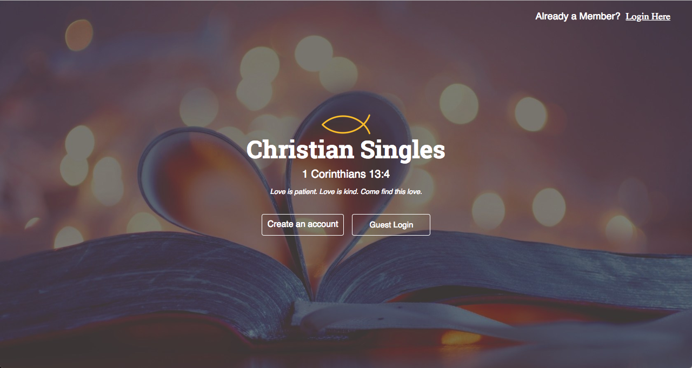

# Christian Singles

[Live site](https://christian-singles.herokuapp.com/#/)

**_Christian Singles_ is an early stage single page web app inspired by the popular dating site _Christian Mingle_. It uses a Ruby on Rails backend combined with a React/Redux frontend.**



### Key Features

- [x] Hosted on Heroku
- [x] User authentication
- [x] Create and maintain user profile, including preferences form
- [x] Browse profiles
- [x] Display match percentage and match summary between users based on preferences
- [x] Option to "like" user profiles
- [x] View list of  all profile likes, mutual profile likes, as well as viewed users, and users who have viewed you


#### User Authentication
BCrypt gem used for safely hashing users passwords. Geokit gem used for authenticating zip codes for properly calculating distance between users.


#### Profile Maintenance

Users have the ability to create and maintain a profile that contains all the information necessary for formulating percentage matches and match summaries with other users. Individual profiles display each user's personal information. Users also fill out a preference form that corresponds to what he or she looks for in a potential romantic partner.

<!--  -->

#### Browse

Users are able to browse the profiles of others. When browsing, users are able to order available profiles by newest, online, distance, and match percentage.

<!--  -->

#### Activity Page

Users are able to view who they have liked, mutual likes, profile views, and users that have viewed them. Only the latest four profiles per each section are displayed but users are able to click on each section to view all profiles in that section.


#### Match Percentages and Match Summaries

The meat of any dating site. Matches were made on the backend based on taking into account the number of stats/preferences being compared to the number that matched between users. A percentage was then derived from this ratio.

Below is the method that calculates the match percentage. It is a bit long although it uses helper methods. This method returns both a percentage as well as a summary paragraph based on that percentage. Match summaries are displayed on each user's profile page.

The total number of points available for matching are 65. Points are earned based on whether users match with each other on their profile as well as their preferences.

```ruby
def match_percent_and_summary(user_viewed)

  matching_points_total = 65 ##total possible points available via comparisons
  #(9 for gender, 9 for distance, 9 for age,
  #18 for two sided attributes, 4 for multi_select_attributes,
  #5 for relationship_seek, 1 for first date match, 6 for height, 4 for hobbies)

  if !match_gender(self.sex_seek, self.gender, self.id).include?(user_viewed) || self.id == user_viewed.id
    return ["no_percent_allowed", "This user is incompatible with you."]
  end
  #^^will return if the gender preferences do not match.

  matching_points = 9 #points earned for meeting gender preferences
  match_summary = "User meets your gender preference. "

  if within_distance?(user_viewed) == true
    matching_points += 9 #points earned for being within distance
    match_summary = match_summary.concat("user is within your desired distance. ")
  else
    match_summary = match_summary.concat("user is NOT within your desired distance. ")
  end

  if within_age?(user_viewed) == true
    matching_points += 9 #points earned for being within age
    match_summary = match_summary.concat("user is within your desired age range. ")
  else
    match_summary = match_summary.concat("user is NOT within your desired age range. ")
  end

  #call method to return points from height
  height_results = return_match_height(user_viewed)
  matching_points += height_results[0]
  match_summary += height_results[1]

  #arrays of "attributes" to compare through in order to make calculations
  #two_sided_attributes allow user to only pick one for himself/herself
  two_sided_attributes = [["religion","religion_seek"], ["education", "education_seek"],
                          ["attendance", "attendance_seek"], ["have_kids", "have_kids_seek"],
                          ["want_kids", "want_kids_seek"], ["relocate", "relocate_seek"],
                          ["marital_status", "marital_status_seek"], ["drink", "drink_seek"],
                          ["smoke", "smoke_seek"]]

  #multi_select_attributes allow user to pick multiple for himself/herself
  multi_select_attributes = [["language", "language_seek"], ["ethnicity", "ethnicity_seek"]]

  #call methods that calculate the points from two above arrays
  two_sided_attributes.each do |attribute_set|
    results = return_match_number_two_sid_attr(user_viewed, attribute_set[0], attribute_set[1])
    matching_points += results[0]
    match_summary = match_summary.concat(results[1])
  end

  multi_select_attributes.each do |attribute_set|
    results = return_match_number_multi_select(user_viewed, attribute_set[0], attribute_set[1])
    matching_points += results[0]
    match_summary = match_summary.concat(results[1])
  end

  #call method to return points from relationship_seek
  results = return_relationship_seek_match(user_viewed)
  matching_points += results[0]
  match_summary = match_summary.concat(results[1])

  #call method to return points from first_date
  results = return_first_date_match(user_viewed)
  matching_points += results[0]
  match_summary = match_summary.concat(results[1])


  #call method to return points from hobbies shared
  hobbies_results = return_match_number_hobbies(user_viewed)
  matching_points += hobbies_results[0]
  match_summary += hobbies_results[1]

  percent_match = (100 * matching_points) / matching_points_total
  match_summary = finalize_match_summary(match_summary, user_viewed.username,
                                        user_viewed.display_name, user_viewed.gender)

  return [percent_match, match_summary]

end
```

### Future Features
1. Instant messaging
